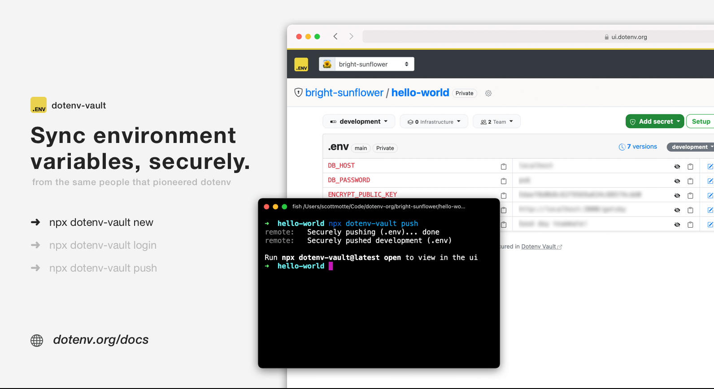

<h1 align="center">
  <a href="https://docs.dotenv.org?r=1"></a>
  <br>
  dotenv-vault
  <br>
</h1>

<h4 align="center">Sync environment variables, securely.</h4>

<p align="center">
  <a href="#usage">Usage</a>
  
  <a href="#commands" target="_blank">Commands</a>
  
  <a href="#commands" target="_blank">Health</a>
  
  <a href="#contributing">Contributing</a>
  
  <a href="#changelog">Changelog</a>
  
  <a href="#license">License</a>
</p>

<p align="center">
  <a href="https://npmjs.org/package/dotenv-vault"></a>
  
  <a href="https://npmjs.org/package/dotenv-vault"></a>
</p>




<p class="text-center">
dotenv-vault securely syncs your .env files across your machines, environments, and team members. Stop sharing .env files over insecure channels like Slack and email - from the same people that pioneered [dotenv](https://github.com/motdotla/dotenv).
</p>

## Usage

Usage is similar to git. Run the command:

```bash
$ npx dotenv-vault new
```

Follow those instructions and then run:

```bash
$ npx dotenv-vault login
```

Then run push and pull:

```bash
$ npx dotenv-vault push
$ npx dotenv-vault pull
```

That's it!

Visit [dotenv.org/docs](https://www.dotenv.org/docs/getting-started/with-dotenv-vault?r=1) for a complete getting started guide.

## Commands

```
$ npx dotenv-vault
Sync environment variables, securely.

VERSION
  dotenv-vault/1.11.0 darwin-arm64 node-v18.3.0

USAGE
  $ dotenv-vault [COMMAND]

COMMANDS
  new       Create your project
  login     Log in to dotenv-vault
  logout    Log out
  open      Open project page
  push      Push .env securely
  pull      Pull .env securely
  versions  List version history
  whoami    Display the current logged in user
  status    Check dotenv-vault operational status
  help      Display help for dotenv-vault.
  update    update the dotenv-vault CLI
```

Visit [dotenv.org/docs](https://www.dotenv.org/docs/dotenv-vault?r=1) for details per command.

## Health

[](https://health.dotenv.org/)
[](https://health.dotenv.org/)

Visit [health.dotenv.org](https://health.dotenv.org) for more information.

## Contributing

See [CONTRIBUTING.md](CONTRIBUTING.md)

## Changelog

See [CHANGELOG.md](CHANGELOG.md)

## License

MIT
