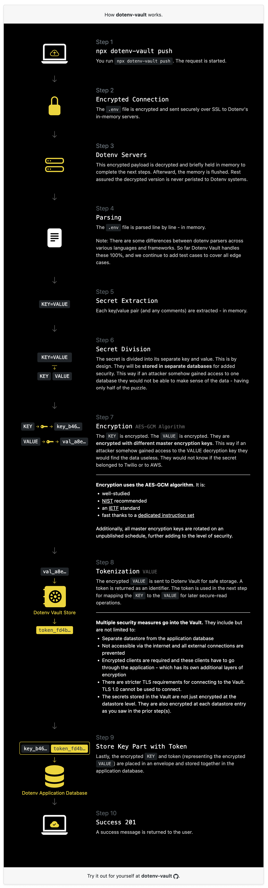

<h1 align="center">
  <a href="https://docs.dotenv.org?r=1"></a>
  <br>
  Dotenv Vault
  <br>
</h1>

<h4 align="center">Sync your .env files, quickly & securely.</h4>

<p align="center">
  <a href="#usage">Usage</a>
  
  <a href="#how-it-works">How It Works</a>
  
  <a href="#commands" target="_blank">Commands</a>
  
  <a href="#health" target="_blank">Health</a>
  
  <a href="#changelog">Changelog</a>
</p>


[](https://www.youtube.com/watch?v=z-lBjxfhWeY)

<p align="center">
  <a href="https://npmjs.org/package/dotenv-vault"></a>
  
  <a href="https://npmjs.org/package/dotenv-vault"></a>
</p>

<p align="center">
<strong>Dotenv Vault</strong> securely syncs your .env files across your machines, environments, and team members. Stop sharing .env files over insecure channels like Slack and email - from the same people that pioneered <a href="https://github.com/motdotla/dotenv">dotenv</a>.
</p>

## Usage

Usage is similar to git. Run the command:

```bash
$ npx dotenv-vault new
```

Follow those instructions and then run:

```bash
$ npx dotenv-vault login
```

Then run push and pull:

```bash
$ npx dotenv-vault push
$ npx dotenv-vault pull
```

That's it!

Visit [dotenv.org/docs](https://www.dotenv.org/docs/getting-started/with-dotenv-vault?r=1) for a complete getting started guide.

## How It Works

<a href="https://www.dotenv.org/docs/security/dotenv-vault"></a>

Visit [dotenv.org/docs](https://www.dotenv.org/docs/security/overview?r=1) to learn more.

## Commands

```
$ npx dotenv-vault
Sync your .env files, securely.

VERSION
  dotenv-vault/1.11.0 darwin-arm64 node-v18.3.0

USAGE
  $ dotenv-vault [COMMAND]

COMMANDS
  new       Create your project
  login     Log in to dotenv-vault
  logout    Log out
  open      Open project page
  push      Push .env securely
  pull      Pull .env securely
  versions  List version history
  whoami    Display the current logged in user
  status    Check dotenv-vault operational status
  help      Display help for dotenv-vault.
  update    update the dotenv-vault CLI
```

Visit [dotenv.org/docs](https://www.dotenv.org/docs/dotenv-vault?r=1) for details per command.

## Health


<br>

<br>

<br>

<br>

<br>


Visit [health.dotenv.org](https://health.dotenv.org) for more information.

## Contributing

See [CONTRIBUTING.md](CONTRIBUTING.md)

## Changelog

See [CHANGELOG.md](CHANGELOG.md)

## License

MIT
